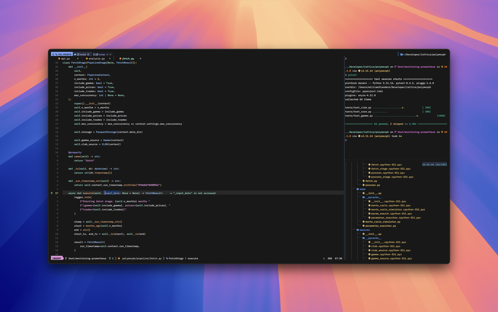

# dotfiles

Configs and dotfiles for neovim (lazyvim), alacritty,
tmux + sesh, hammerspoon, and whatever other
miscellaneous stuff + keybinds for my setup

Everything is currently only setup for mac (just my daily driver right now)
but i'll fix that whenever i get around to cleaning and
booting some distro (probably arch) on my fat home rig
